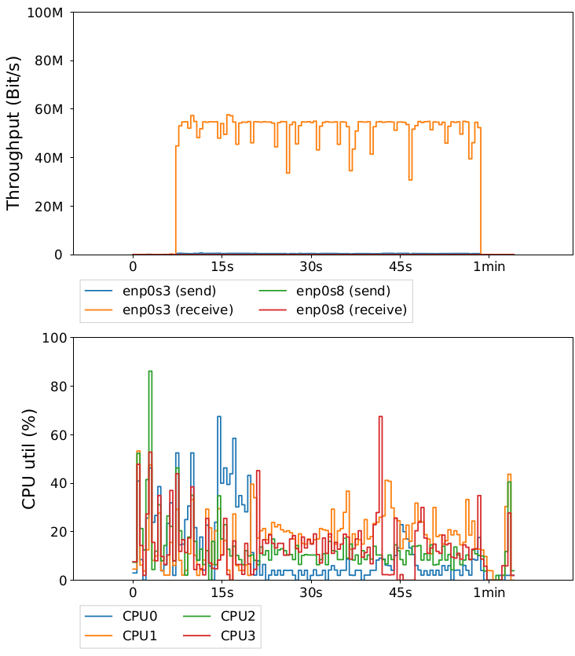
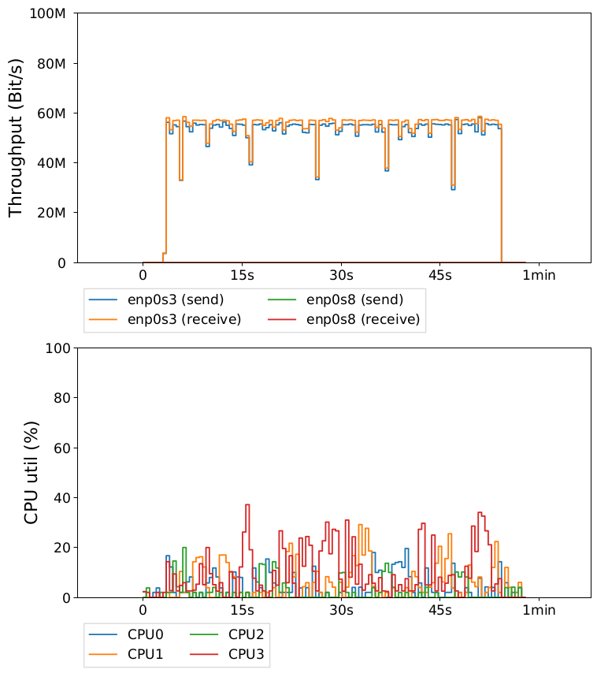

# 1. Einleitung
## 1.1. Problematik
Dieses Projekt soll dazu dienen, dass Nutzer mit einem beliebigen Endgerät die Möglichkeit haben, das Multipath-TCP (MPTCP) Protokoll zu nutzen. Um dieses Protokoll nutzen zu können, sind Einstellungen am Kernel notwendig, die bei den meisten Betriebssystemen nicht trivial sind. 
In Rahmen dieses Projekts wird ausgenutzt, dass es eine Implementierung eines *MPTCP Linux-Kernels* gibt, der einfach installiert werden kann
## 1.2. MPTCP
Multipath-TCP ist ein Standart der Transportschicht, beschrieben in [RFC 6824](https://tools.ietf.org/html/rfc6824). Es beschreibt die logische Zusammenfassungen mehrerer TCP Verbindungen zu einer logischen Verbindung, mit dem Ziel die Bandbreite zu erhöhen. Dabei kann ausgenutzt werden, dass ein Endgerät mehrere verschiedene Netzwerkanbindungen besitzt um somit die Bandbreite der gesamten Verbindung auf annähernd die Summe der Bandbreite der einzelnen Anbindungen zu erhöhen. 

    

Die Grafik zeigt einen beispielhaften Aufbau einer *MPTCP-Verbindung* über DSL und LTE zum selben Server. Auf diese Weise könnte also zum Beispiel eine Datei über beide Interfaces übertragen werden. 

## 1.3. Idee
Zum Aufbau einer *MPTCP-Verbindung* ohne Endgeräte mit installiertem MPTCP-Kernel zu benötigen, soll hier ein Socks-Proxy verwendet werden, der auf einem Linux Betriebssystem mit entsprechend installiertem MPTCP-Kernel läuft. Die Implementierung des Proxys wird so abgeändert, dass er anhand einer Konfigurationsdatei die Socket Einstellungen der ausgehenden Verbindung anpasst. Es müssen also alle IP-Adressen der Webseiten in die Datei geschrieben werden, zu denen man eine *MPTCP-Verbindung* aufbauen möchte.
Zusätzlich können einige Parameter dabei eingestellt werden. Wird vom Nutzer auf dem Endgerät der Proxy verwendet, kann dieser stellvertretend eine *MPTCP-Verbindung* aufbauen. 
Es wird also eine reguläre Verbindung zwischen Proxy und Nutzer aufgebaut und nur zwischen Proxy und Server wird das MPTCP-Protokoll verwendet. Hierdurch ist es nicht mehr relevant, auf welchem Betriebssystem das Endgerät läuft und es muss auch keine zusätzliche Software installiert werden. Damit dieser Aufbau sinnvoll angewendet werden kann, muss also das Bottleneck zwischen Proxy und Server liegen, da sonst keine Bandbreite gewonnen werden kann.  

Um die Einstellungen am Server nicht nur statisch zu halten, kann die Konfigurationsdatei mithilfe einer REST-API manipuliert werden. Es ist also möglich zur Laufzeit Einstellungen von Verbindungen zu verändern. Eine solche Änderung wird allerdings erst ab der nächsten Verbindung zum angegebenen Ziel wirksam, da ein aktiver Socket nicht mehr verändert werden kann.  

Die Funktionalität ist auch in der folgenden Graphik dargestellt:
  

<div style="page-break-after: always;"></div>

# 2. Inbetriebnahme
## 2.1. Einrichtung des Kernels
Um den bereitgestellten Proxy mit MPTCP im vollen Umfang nutzen zu können, muss MPTCP installiert und eingerichtet werden. Dafür müssen folgende Schritte ausgeführt werden:
- Installation des Kernels
- Konfiguration der Routing Tabellen
- Konfiguration der MPTCP Settings **(MPTCP_ENABLE Feld muss auf 2 gesetzt werden)**  

Eine detaillierte Anleitung dazu findet man [hier](http://www.multipath-tcp.org).  

Die Schritte für die minimale Konfiguration sind nachfolgend aufgeführt.
Die Installation des Kernels an sich lässt sich durch das apt-Repository durchführen:
```
sudo apt-key adv --keyserver hkps://keyserver.ubuntu.com:443 --recv-keys 379CE192D401AB61
sudo sh -c "echo 'deb https://dl.bintray.com/multipath-tcp/mptcp_deb stable main' > /etc/apt/sources.list.d/mptcp.list"
sudo apt-get update
sudo apt-get install linux-mptcp
```
Nachdem der Kernel installiert ist, werden für die automatische Konfiguration noch zwei Dateien benötigt, die mit den folgenden Befehlen an die richtige Stelle herunterladen und ausführbar gemacht werden können:
```
sudo wget https://raw.githubusercontent.com/multipath-tcp/mptcp-scripts/master/scripts/rt_table/mptcp_up -O /etc/network/if-up.d/mptcp_up
sudo chmod +rwx /etc/network/if-up.d/mptcp_up
sudo wget https://raw.githubusercontent.com/multipath-tcp/mptcp-scripts/master/scripts/rt_table/mptcp_down -O /etc/network/if-post-down.d/mptcp_down
sudo chmod +rwx /etc/network/if-post-down.d/mptcp_down
```
Zuletzt muss noch die Einstellung *MPTCP_ENABLE* auf 2 gesetzt werden. Dadurch wird MPTCP für jeden Socket aktiviert ist, der es aktiv setzt:
```
sudo sysctl -w net.mptcp.mptcp_enabled=2
```
An dieser Stelle ist ein Neustart erforderlich, um die Änderungen wirksam zu machen und den richtigen Kernel zu starten.  
  
Nachdem die Installation abgeschlossen ist, muss der Kernel manuell gestartet werden, wenn die Version des MPTCP-Kernels niedriger ist als die Version des regulären Linux Kernels. Das wird gemacht, indem während des Neustarts des Betriebssystems kurz vor dem Booten die Taste **Shift** gedrückt wird, was den Grub Bootmanager öffnet. Wird dann der Punkt *Advanced Options for Ubuntu* ausgewählt, muss der MPTCP-Kernel gestartet werden. Wird das in einer virtuellen Maschine (VirtualBox) gemacht, kann ein Leistungseinbruch und eine verkleinerte Anzeige festgestellt werden, das ändert allerdings nichts an der Funktionalität.  
Ein weiterer Aspekt der in einer virtuellen Maschine beachtet werden muss, die Veränderung der MPTCP-Pakete bei einer Verbindung über NAT, die zu deren Unbrauchbarkeit führt. Eine funktionierende Alternative ist eine Anbindung der Netzwerschnittstelle(n) über eine Netzwerkbrücke.

## 2.2 Installation der Module
Das Python Script für die REST-API benötigt einige Module, die teilweise nicht ganz intuitiv installiert werden können. Um alle notwendigen Module zu installieren, müssen folgende Befehle in einem Terminal ausgeführt werden:
```
sudo apt update
sudo apt install python3
sudo apt install python3-pip
``` 
Anschließend wird die virtuelle Umgebung mit `source flask/bin/activate` aktiviert. Darin werden dann die notwendigen Python-Module installiert:
```
sudo -H pip3 install flask
sudo -H pip3 install https://github.com/rthalley/dnspython/archive/v1.15.0.zip
```

## 2.3 Starten der Programme
Um alle Funktionalitäten des Servers zu aktivieren, müssen zwei Programme gestartet werden.  

Erstens wird der eigentliche Socks-Proxy gestartet:  `sudo ./microsocks`. Sollte im Programm eine Änderung gemacht werden oder der Code noch nicht kompiliert sein, kann durch das Makefile einfach der Befehl `make microsocks` ausgeführt werden.  

Zweitens muss der [Server](./flask/REST.py) mit der REST API gestartet werden.  Dafür muss in einem neuen Terminal die virtuelle Umgebung mit dem Befehl `source flask/bin/activate` und der Server gestartet werden `python3 ./flask/REST.py`. Wird der Server ohne Parameter gestartet, hört er auf localhost:5000. Wenn von außerhalb auf das Interface zugegriffen werden soll, kann die lokale Adresse auf der gehört werden soll, angegeben werden.  

Sobald beide Programme laufen, ist der Proxy für eine beliebige Maschine einsatzbereit. Dafür muss in der entsprechenden Software (z.B. Firefox) einfach der Proxy in den Einstellungen aktiviert, die IP des Servers eingetragen und der Port 1080 angegeben werden.
Die REST Befehle lassen sich mit einer beliebigen Software (z.B. Postman oder Visual Studio Code) absetzen.  

## 2.4 Konfiguration der Verbindungen
Um die Socket Optionen für ausgehende Verbindungen zu setzen, verwendet der Proxy eine [Konfigurationsdatei](./res/mptcp_settings). Hier sind die einzelnen Einstellungen zu den zugehörigen Einstellungen abgespeichert. Eine Zeile beinhaltet 4 Werte jeweils durch ein Komma getrennt und abgeschlossen mit einem Komma. In der letzten Zeile des Dokuments muss immer ein Punkt stehen, um das Ende der Datei zu kennzeichnen.  

Ein Datensatz besteht aus 4 Werten. An erster Stelle steht die **IP-Adresse** gefolgt von einer **1 oder 0**, je nach dem ob Multipath-TCP für diese Verbindung aktiviert werden soll (1) oder nicht (0). An dritter Stelle steht der Name des **Schedulers** der die Werte *default, roundrobin oder redundant* annehmen kann. Der letzte Wert definiert den **Path-Manager** und kann die Werte *default, fullmesh, ndiffports oder binder* annehmen.  

Je nach Bedarf ist es auch möglich die Konfiguration einer Verbindung manuell in der Datei einzupflegen. Wegen der Gefahr von falscher Formatierung oder Tippfehlern ist allerdings der Weg über das REST-Interface zu bevorzugen (vgl. [3.3 "Implementierung der REST-Schnittstelle](#33-implementierung-der-rest-schnittstelle)).

<div style="page-break-after: always;"></div>

# 3. Anpassungen an der Software 
## 3.1 Auswahl des Proxys
Im Rahmen des Projektes war das Ziel nicht einen eigenen Proxy zu schreiben, sondern nur einen geeigneten zu finden und diesen so weit zu verändern, dass die Beschriebene Funktionalität umgesetzt werden kann. Es wurde also eine Implementierung gesucht, die so wenig Overhead wie möglich produziert und somit - wenn möglich - keinen Einfluss auf die Übertragungsgeschwindigkeit nimmt. Außerdem war ein weiteres essentielles Kriterium, dass es in der Implementierung gut möglich ist die Socket Parameter einzustellen.  

Die Wahl fiel schlussendlich auf den sogenannten [microsocks](https://github.com/rofl0r/microsocks), der durch einen relativ kurzen C-Code sehr übersichtlich ist. Um sicherzustellen, dass auch die Performance zufriedenstellend ist, wurden noch einige Tests durchgeführt. Dafür wurde je eine ca. 300MB große Datei heruntergeladen, einmal mit Proxy und einmal ohne und die CPU Auslastung wurde gegenübergestellt.
Ein Auszug aus den Ergebnissen wird hier dargestellt:
|Ohne Proxy | Mit Proxy|
|:---------:|:--------:|
|||

In dieser Stichprobe ist zu sehen, dass die CPU Auslastung sehr schwankend, aber mit aktivem Proxy kaum erhöht ist. Die Übertragungsrate ist in beiden Fällen in etwa bei 50Mbps, was der Bandbreite des Anschlusses entspricht. Durch die Messungen wurde festgestellt, dass durch die Verwendung des Proxys kein Einbruch der Verbindungsgeschwindigkeit merkbar ist. Auch die CPU Auslastung wird durch die Verwendung kaum erhöht.  

Der Code des Proxys ist für alle Zwecke frei verwendbar. Die zugehörige Lizenz befindet sich [hier](./COPYING).

## 3.2 Anpassung des Proxys 
Wie schon oben beschrieben, muss der Proxy nur insofern angepasst werden, dass er aus einer Konfigurationsdatei die vorhergesehenen IP-Adresse - Konfiguration Paare ausgelesen und für die entsprechenden Verbindungen als Socket Parameter gesetzt werden.
Für die Anpassung ist also der einzige Berührungspunkt die Datei in der die Verbindung zum Ziel aufgebaut wird, genauer die Stelle an der das Socket erstellt wird. Diese Implementierung ist in der Datei [sockssrv.c](./sockssrv.c) in der Methode *connect_socks_target* zu finden.
An dieser Stelle wird dann die Datei eingelesen und die jeweiligen IP-Adressen in der Datei werden mit dem aktuellen Ziel verglichen. Wenn eine passende Adresse in der Datei gespeichert ist, dann werden die abgespeicherten Einstellungen verwendet. Gibt es keinen Treffer, werden die Standardeinstellungen verwendet. 

## 3.3 Implementierung der REST Schnittstelle
Für die [Implementierung](./flask/REST.py) der REST-Schnittstelle wurde Python mit dem Framework Flask verwendet. Die Aufgabe des Programms besteht darin, die verschiedenen Requests entgegenzunehmen und entsprechend zu Antworten und gegebenenfalls die Datei zu verändern. 
Der Inhalt eines POST-Requests ist im JSON Format wie folgt:
```
{
    "enable": "{0|1}",  
    "ip": "<dns-name>",
    "path_manager": "{default|fullmesh|ndiffports|binder}",
    "scheduler": "{default|roundrobin|redundant}"
}
```


